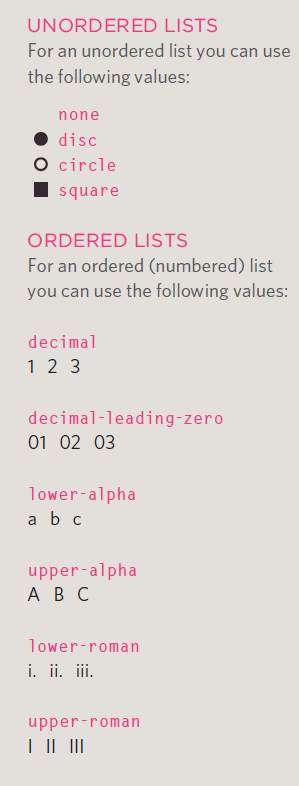
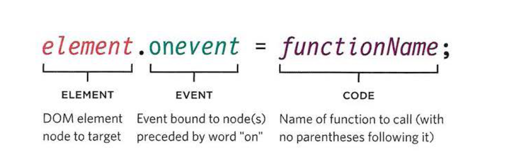

# Forms:
Traditionally, the term 'form' has referred to a printed document that contains spaces for you to fill in information.

## Form Controls:
- ADDING TEXT:
- Password input
- Text area (multi-line)
- Ma king Choices

## How Forms Work:
- A user fills in a form and then presses a button to submit the information to the server.
- The name of each form control is sent to the server along with the value the user enters or selects.
- The server processes the information using a programming language such as PHP, C#, VB.net, or Java. It may also store the information in a database.
- The server creates a new page to send back to the browser based on the information received.

## Form Structure:
` <form>` :
Form controls live inside a `<form>` element. This element should always carry the action attribute and will usually have a method and id attribute too.


```<form action="http://www.example.com/subscribe.php"
method="get">
<p>This is where the form controls will appear.
</p>
</form>
```

### Text input:
The <input> element is used to create several different form controls. The value of the type attribute determines what kind of input they will be creating.

### Password Input:
type="password" When the type attribute has a value of password it creates a text box that acts just like a single-line text input, except the characters are blocked out.
They are hidden in this way so that if someone is looking over the user's shoulder, they cannot see sensitive data such as passwords.

# Text arya :
The ```<textarea>``` element is used to create a mutli-line text input. Unlike other input elements this is not an empty element. It should therefore have
an opening and a closing tag.


# List style type :
The list-style-type property allows you to control the shape or style of a bullet point (also known as a marker).



### Table proprites:
- **width** to set the width of the table
- **padding** to set the space between the border of each table cell and its content.
- **text-transform**  to convert the content of the table headers to uppercase.

### DIFFERENT EVENT TYPES:
Here is the syntax to bind an event to an element using an event handler, and to indicate which function should execute when that event fires



