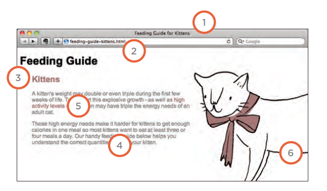

# IMAGES:

Controlling the size and alignment of your images using CSS keeps rules that affect the presentation of your page in the CSS and out of the HTML markup.


####  Controlling sizes of images in CSS:

``` img.large {
width: 500px;
height: 500px;}
img.medium {
width: 250px;
height: 250px;}
img.small {
width: 100px;
height: 100px;}
``` 
#### AligNing images using CSS :
```  img.align-left {
float: left;
margin-right: 10px;}
img.align-right {
float: right;
margin-left: 10px;}
img.medium {
width: 250px;
height: 250px;}
``` 

##### background-image: The background-image
property allows you to place an image behind any HTML element. This could be the entire page or just part of the page. By default, a background image will
repeat to fill the entire box.


```  body {
background-image: url("images/pattern.gif");} 
``` 

##### Repeating Images: background-repeat background-attachment:
**repeat:**
The background image is repeated both horizontally and vertically (the default way it
is shown if the backgroundrepeat property isn't used).

In every page of your website there are seven key places where keywords (the words people might search on to find your site) can appear in order to improve its findability



- To put your site on the web, you will need to obtain a domain name and web hosting.
- FTP programs allow you to transfer files from your local computer to your web server.
- Many companies provide platforms for blogging, email newsletters, e-commerce and other popular website tools (to save you writing them from scratch).

SELECTING ELEMENTSnBY TAG NAME:
The get El ementsByTagName () method allows you to select elements using their tag name.